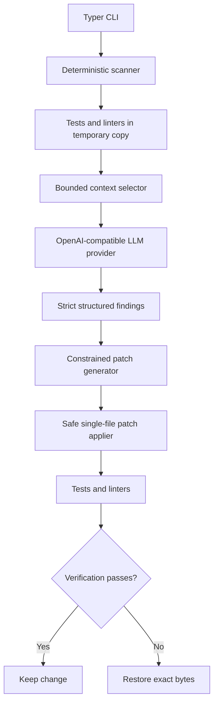

# Repo Doctor

Repo Doctor 0.2 is a local-first repository health checker with an optional AI coding-agent
workflow. Its deterministic scanner discovers the project stack, runs configured tests and
linters in an isolated copy, and produces an explainable Markdown report. When explicitly
enabled, semantic analysis adds validated findings and can propose one minimal repair that is
kept only after verification succeeds.

The ordinary workflow remains offline: `repo-doctor scan .` never creates an AI provider or
contacts an external service.

## Requirements and installation

Python 3.12 or newer is required. On Windows PowerShell:

```powershell
py -3.12 -m venv .venv
.\.venv\Scripts\Activate.ps1
python -m pip install -e ".[dev]"
repo-doctor --help
```

On Linux or macOS, activate with `source .venv/bin/activate` instead.

## Deterministic and AI modes

Deterministic mode detects conventional Python and Node.js projects and discovers `pytest`,
`ruff check .`, `npm test`, and `npm run lint`. Commands are argument vectors executed without a
shell against a temporary repository copy.

```powershell
# Local deterministic report; no provider is contacted
repo-doctor scan .

# Save the local report
repo-doctor scan . --output health.md

# Conservative trailing-whitespace repair for parseable Python source
repo-doctor fix .
```

AI mode is opt-in:

```powershell
repo-doctor scan . --ai
repo-doctor scan . --ai --output health.md
repo-doctor fix . --ai --dry-run
repo-doctor fix . --ai
```

`fix --ai` requires a Git repository, a clean worktree, and at least one discovered test or lint
command. It considers at most one finding whose confidence is at least 0.85. Dry run performs
analysis and displays a unified preview without modifying the target.

## Provider configuration

Repo Doctor uses an OpenAI-compatible chat-completions HTTP interface and is not coupled to a
specific vendor. Set the three required variables for AI mode. The request timeout is optional and
defaults to 180 seconds, which accommodates semantic analysis of repository context:

```powershell
$env:REPO_DOCTOR_API_KEY = "your-provider-key"
$env:REPO_DOCTOR_BASE_URL = "https://provider.example/v1"
$env:REPO_DOCTOR_MODEL = "provider-model-name"
$env:REPO_DOCTOR_REQUEST_TIMEOUT = "180"
repo-doctor scan . --ai
```

The base URL may be a versioned API root or the complete `/chat/completions` endpoint. Repo Doctor
does not load `.env` files automatically; `.env.example` is documentation only. The timeout accepts
positive finite seconds, including decimal values. Missing or invalid configuration produces an
actionable report message. Keys and authorization headers are never included in prompts, logs,
reports, or object representations.

## Architecture



The deterministic pipeline is always run first:

1. `detector.py` recognizes manifests and supported verification commands.
2. `scanner.py` inventories text and runs checks in a temporary copy.
3. `analyzer.py` applies explicit deterministic rules and establishes the base score.
4. `report.py` renders command evidence, findings, and scoring details.

The optional AI pipeline lives under `repo_doctor/ai/`:

- `selector.py` ranks failed-output references, stack source, configuration, small core modules,
  and README context within hard file, byte, and total-character limits.
- `provider.py` defines the vendor-neutral protocol; `openai_compatible.py` implements HTTP calls.
- `parser.py` accepts exact JSON schemas and rejects missing fields, extra fields, unsafe paths,
  invalid severity, and out-of-range confidence.
- `workflow.py` ensures findings reference only files actually sent to the provider.
- `patching.py` validates and atomically applies one unique text replacement.
- `fixer.py` selects one issue, verifies it, and keeps or rolls back the change.

## AI semantic report and scoring

A validated finding records an ID, title, category, controlled severity, confidence, relative
file, line range, explanation, evidence, and suggested fix. Arbitrary provider prose never becomes
program state. A report entry resembles:

```markdown
## AI Semantic Analysis

### Finding 1: Exact stock cannot be fulfilled

- Severity: High
- Confidence: 0.93
- File: `inventory.py`
- Lines: 6

Problem:
The equality boundary is rejected.
```

The deterministic score remains visible. Only validated findings at confidence 0.85 or higher
change the final score: critical costs 20 points, high 12, medium 5, and low 0. The final score is
clamped to 0–100, so identical validated input always produces the same score.

## Context selection and data boundaries

Repo Doctor never sends the entire repository blindly. Defaults are 20 files, 100,000 bytes per
file, and 200,000 total characters. Repositories larger than this are ranked and truncated rather
than rejected. It excludes Git/tool caches, virtual environments, dependencies, build output,
coverage artifacts, generated/minified files, binaries, large lockfiles, and likely secrets such
as `.env*`, `*.pem`, `*.key`, `credentials*`, and `secrets*`. Symlinks are not selected.

Source and command evidence sent to the configured endpoint can still be sensitive. Review the
provider's data policy and use `--ai` only for repositories you are authorized to disclose.

## AI fix, verification, and rollback

The model cannot return shell commands or arbitrary diffs. The accepted patch has exactly five
fields: `file`, `old_text`, `new_text`, `reason`, and `confidence`. Before applying it, Repo Doctor
requires that:

- the relative path is traversal-free, inside the repository, non-secret, and non-ignored;
- the target is a regular, non-symlink UTF-8 text file;
- the file hash still matches the context analyzed by the model;
- `old_text` occurs exactly once;
- confidence is at least 0.85 and replacement size limits are respected.

Repo Doctor captures the target's exact bytes, applies the replacement atomically, and reruns the
same discovered verification commands in an isolated copy. It keeps the edit only when every
command passes and the deterministic score does not regress. Failure or a verification exception
restores the exact captured bytes. A rollback failure is reported explicitly and requires manual
Git restoration.

## Security model

- No AI provider is initialized unless `--ai` is present.
- API keys remain in request headers and are never printed or placed in prompts; credential-like
  environment variables are removed from verification subprocesses.
- Provider JSON is treated as untrusted and validated twice, including custom providers/fakes.
- Paths are normalized and checked against traversal, symlinks, secret patterns, and repository
  boundaries.
- No provider-supplied command is ever executed; application subprocesses use `shell=False`.
- Symlinks are excluded from text-file fixes and isolated verification copies, preventing external
  targets and broken links from being followed.
- AI fix requires a clean Git worktree and changes at most one regular text file.
- Exact-byte snapshots support automatic rollback of the only modified file.

Scanning still executes repository-defined test and lint commands in a temporary copy. Those
commands are local third-party code and should be treated with the same care as running the
project's test suite directly.

## Supported platforms

Repo Doctor supports Windows, Linux, and macOS. Application logic and tests use `pathlib`,
`shutil`, `tempfile`, and argument-vector `subprocess` calls. No Unix-only utilities or
`shell=True` commands are required.

## Limitations

- Detection currently covers conventional Python and npm layouts, not arbitrary monorepos.
- Dependencies are not installed automatically; missing executables appear as failed checks.
- Node dependency directories are omitted from the temporary copy, so tools must be available to
  the discovered command through the environment.
- OpenAI-compatible endpoints differ; a provider must support chat completions and JSON-object
  response formatting.
- Context selection is deterministic keyword/path ranking, not a full dependency graph.
- Repositories that intentionally depend on symlinked source need equivalent regular files for
  verification because Repo Doctor excludes symlinks from its temporary copy.
- AI findings can be wrong. Dry run and code review remain recommended even with verification.
- Patch generation supports one unique text replacement in one UTF-8 file per invocation.
- A real external provider is never required by the automated test suite.

## Development

```powershell
python -m pytest
ruff check .
ruff format --check .
python -m compileall -q repo_doctor tests
repo-doctor scan tests\fixtures\python_project
```

AI tests use fake providers and the semantic fixture under `tests/fixtures/semantic_bug`. The
fixture contains a realistic equality-boundary bug that passes its basic syntax, test, and lint
checks; mocked findings and patches keep the suite deterministic and offline.
