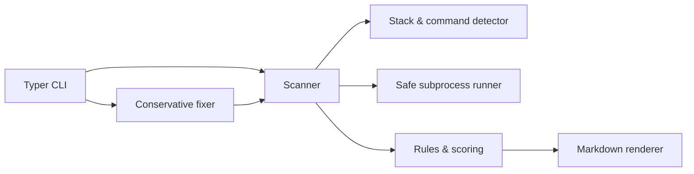

# Repo Doctor

Repo Doctor is a small, local-first coding-agent CLI that turns repository evidence into a useful Markdown health report. It discovers rather than guesses test and lint commands, captures their results, and provides a transparent score. Verification runs against a temporary copy, so a scan cannot litter or alter the repository being diagnosed.

## Motivation

Understanding an unfamiliar repository often starts with repetitive archaeology: identify its stack, find the intended checks, run them, and organize the failures. Repo Doctor makes that first pass consistent while keeping source code and command output local.

## Installation

Python 3.12 or newer is required.

```bash
python -m venv .venv
. .venv/bin/activate
python -m pip install -e '.[dev]'
repo-doctor --help
```

## Usage

```bash
# Print a report
repo-doctor scan /path/to/repository

# Save the report
repo-doctor scan /path/to/repository --output health.md

# Make at most one conservative change (requires a clean Git worktree)
repo-doctor fix /path/to/repository
```

The scan detects Python (`pyproject.toml`, `requirements.txt`, or `setup.py`) and Node.js (`package.json`). It runs configured/discoverable `pytest`, `ruff check .`, `npm test`, and `npm run lint` checks with a timeout and without invoking a shell.

## Architecture



- `cli.py` owns user interaction and exit codes.
- `scanner.py` inventories files and verifies an isolated temporary copy.
- `detector.py` recognizes manifests and configured commands.
- `runner.py` executes argument vectors and records output, status, and duration.
- `analyzer.py` applies simple explainable rules; `report.py` renders the result.
- `fixer.py` enforces Git safety and applies at most one minimal whitespace repair.

## Sample report

```markdown
# Repo Doctor Health Report
## Detected Technology Stack
Python
## Test Results
### Python tests: PASS
## Health Score (0-100)
**100/100**
```

Every full report also includes project overview, repository statistics, lint results, potential bugs, maintainability issues, and prioritized recommendations.

## Safety and limitations

- Scan commands run in a temporary copy, but they are still local third-party project code. Use normal caution with untrusted repositories.
- Dependencies are not installed automatically; missing executables are reported as failed checks.
- Node dependency directories are excluded from the verification copy, so dependencies must be otherwise available or installed by the project's command.
- Detection covers conventional Python and npm layouts only. The scoring model is intentionally simple, not an AI semantic review.
- Fix mode currently removes trailing whitespace from one text file. It refuses non-Git repositories and dirty worktrees, and never commits or resets changes.

## Roadmap

- Add configurable command policies and richer monorepo/workspace detection.
- Parse test/lint output into source-level findings.
- Add opt-in local-model analysis and additional safe fix recipes.
- Add JSON/SARIF output, ignore rules, score history, and package-manager detection.

## Development

```bash
python -m pytest
ruff check .
repo-doctor scan tests/fixtures/python_project -o /tmp/repo-health.md
```
